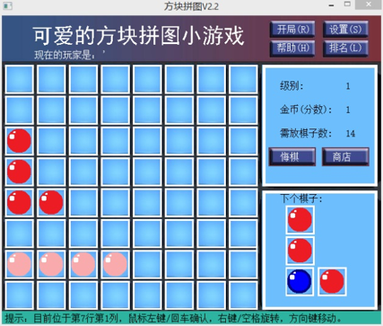

# My Tetris Game
## Introduction 
### Rules
- Use mouse or keyboard to move and place tetrominoes onto the board.
- When there is a 3 by 3 or larger region that is all placed with tetrominoes, they are all destroyed and the player gains scores.
- The player comes to the next stage if they place enough tetrominoes, but the tetrominoes remained when level-up can become undestroable with probability.
- The player can buy tool by spending scores they earned to help them.
## Get Started
Download this repository, extract, then run `release/方块拼图V2.2.1224.exe` in Windows XP/Vista/7/8.x.
## Develop
### Prerequisites
- Microsoft Virtual Studio C++ 6.0+
- [Easy Graphic Engines](http://misakamm.github.io/xege/man/index.htm)
## Versions
- V1.7: global variables are used
- V2.2: no global variable is used
To develop, modify `.h` and `.cpp` files in either `V1.7` or `V2.2` folder.
## Preview

## Functions (Simplified Chinese only)
1. 欢迎：打开游戏后，如果用户之前没有存档，则只需点击屏幕中的按钮或者用键盘按Enter键即可触发登录系统；如果有存档，游戏将主动提示是否读取存档。
2. 登录游戏：每个玩家都有一个账号，当游戏开始时需要登录。如果在输入框输入已经存在的用户，游戏将判断该用户是否有密码，如果有则会要求输入密码。如果用户输入密码错误五次游戏将返回到输入用户名界面。如果输入框中输入了不存在的用户，游戏将自动创建新用户，并且询问请求设置密码，用户可以选择不设置，设置密码或输入正确密码后将进入游戏界面。
3. 初始游戏：游戏界面函数功能包括：游戏开始时和过关时初始化游戏界面、如果有存档读取数据、显示下一个棋子、判断是否能够继续游戏、对每次点击游戏界面操作进行处理。
4. 判断点击游戏界面：此功能会对鼠标或键盘对于在游戏界面做出的点击进行判断，当鼠标点击中央棋盘区域、各种功能按钮，或者键盘点击方向键、各种替代功能按钮的按键时，该功能函数返回特定值。
5. 画出临时棋子：当鼠标移动到中央棋盘区或者键盘按下方向键后，游戏将在棋盘上显示出棋子放置在此处的临时状态。再次功能中棋子的颜色为正常棋子颜色亮度加0.5对应的浅色棋子。如果该处不能放置，则临时棋子的样式为灰色棋子上有一个红色叉子。
6. 画出棋子：当鼠标点击中央棋盘区域或者键盘按下回车键，且该处可以放置棋子时，游戏将在该处放置棋子。
7. 消除棋子：此功能每放置一个棋子后执行一次，当屏幕中出现面积大于等于3×3面积的棋子时，游戏将消除这些棋子，并且在总分中加入相应分数。其中，如果游戏局面中出现同时出现两块可消除的区域但有部分重合时，游戏将优先消除面积大的部分；如果面积相等，将优先消除左上角行列值小的区域；如果左上角棋子为同一个将优先消除高度大于宽度的区域。
8. 游戏结束：此功能每放置一个棋子后执行一次，当整个棋盘都不能再放下即将出现的棋子时，游戏结束。此时用户将看到游戏结束后的排行，并且可以选择重新游戏或者返回欢迎界面。
9. 拓展：悔棋：此功能基于在每放置一个棋子后，游戏将把每次操作的信息存储在文件中。当玩家在已经放置了棋子以后可以通过悔棋功能回到之前的状态。
10. 显示排行：该功能将在点击“排名”按钮时执行。游戏将首先从分数保存文件中读取所有用户的分数记录形成链表，然后将前十名显示在界面上。最后从开始查找当前用户的排名。
11. 显示帮助：该功能将在点击“帮助”按钮时执行。游戏将依次载入帮助图片文件中的内容，形成动画。同时在动画过程中可以随时点击关闭帮助界面。
12. 显示设置：该功能将在点击“设置”按钮时执行。该界面中可以选择修改用户名、修改密码、新建用户、删除用户、修改难度以及修改棋子颜色。
13. 修改/添加/删除用户：这一系列功能都会从存储用户列表的文件中形成链表，然后对链表进行修改，最后再重新写入文件中。
14. 拓展：修改棋子颜色：该功能将可以修改棋子颜色，在界面中会显示一个调色板，当用户点击某颜色后，函数返回相应的坐标值代替其颜色。
15. 拓展：商店：在商店中有多种不同功能的道具，通过消耗相应的分数（金币）兑换。功能包括将所有灰色棋子删除、将所有灰色棋子变为可以消除的棋子、任选棋子样式、使用只占一格的棋子、消除一个非灰色棋子、消除3×3面积内的任意棋子等。
